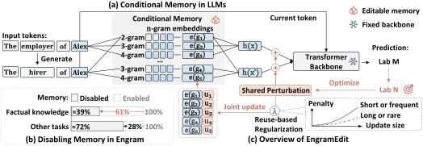
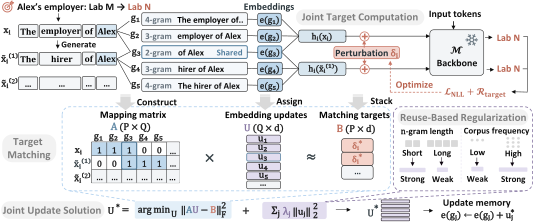

<a name="readme-top"></a>

<div align="center">
  
  <h1>EngramEdit: Decoupled Knowledge Updates in LLMs through Conditional Memory</h1>
  <a href="https://modalitydance.github.io/EngramEdit/">
    
  </a>
  <a href="https://arxiv.org/abs/2610.10533">
    
  </a>
  <a href="https://huggingface.co/papers/2610.10533">
    
  </a>
  <a href="https://huggingface.co/collections/ModalityDance/engramedit">
    
  </a>
  <a href="./LICENSE">
    
  </a>
</div>

**Conditional memory** expands an LLM’s capacity through learned **n-gram embeddings**. At each token position, the model uses token sequences of different lengths ending at that position to look up embeddings that participate in its computation. **EngramEdit** enables factual knowledge updates through this memory. It first computes the memory representations needed to predict revised facts, then jointly updates the corresponding embeddings across expressions and edits. Stronger penalties on frequently reused embeddings help preserve unrelated knowledge. Updated facts remain usable across different expressions and in multi-hop reasoning, while general capabilities are largely preserved.

### 🪐 Key Features

- **Effective knowledge updates.** Revise factual knowledge with high editing success by updating conditional memory alone.
- **Cross-expression recall and reasoning.** Recall revised facts across unseen expressions and use them in multi-hop reasoning.
- **Knowledge and capability preservation.** Largely preserve unrelated knowledge and general capabilities as factual updates accumulate.

<div align="center">
  
  <p><em>From conditional memory to an editable knowledge interface.</em></p>
</div>

## 🔥 News

- **[2026.10]** Our [paper](https://arxiv.org/abs/2610.10533) is now available on arXiv.
- **[2026.10]** Initial release of EngramEdit code and project page.

## 📑 Table of Contents

- [🔥 News](#-news)
- [📑 Table of Contents](#-table-of-contents)
- [🚀 Quick Start ](#-quick-start-)
  - [1. Installation](#1-installation)
  - [2. Data](#2-data)
    - [Step 1. Download the Data](#step-1-download-the-data)
    - [Step 2. Generate Expressions](#step-2-generate-expressions)
    - [Step 3. Build Frequency Caches](#step-3-build-frequency-caches)
  - [3. Running](#3-running)
    - [Training](#training)
    - [Evaluation](#evaluation)
- [🧪 Usage Example ](#-usage-example-)
- [✨ How It Works ](#-how-it-works-)
- [🌱 Acknowledgements ](#-acknowledgements-)
  - [🔗 Related Projects](#-related-projects)
- [📚 Citation ](#-citation-)

## 🚀 Quick Start <span id="quick-start"></span>


### 1. Installation

Use Python 3.11 or 3.12 with PyTorch 2.9.1. The commands below install the CUDA 12.8 build:

```bash
conda create -n engramedit python=3.11 -y
conda activate engramedit
pip install torch==2.9.1 --index-url https://download.pytorch.org/whl/cu128
pip install -r requirements.txt
```

### 2. Data

Preparation has three steps: download the data, generate additional expressions, and estimate `n`-gram frequencies for regularization. Dataset identifiers are `mcf` (CounterFact), `zsre`, and `mquake`.

#### Step 1. Download the Data

Download LongCat-Flash-Lite, the editing benchmarks, and the tokenization resources.

```bash
hf download meituan-longcat/LongCat-Flash-Lite --local-dir data/LongCat-Flash-Lite
python scripts/prepare/download.py --datasets mcf zsre mquake
python -m nltk.downloader punkt punkt_tab
```

#### Step 2. Generate Expressions

Use the model to generate alternative expressions of each fact. `--limit` sets how many dataset cases to process, starting from the first case; `--target_count` sets the requested number of valid additional expressions per fact.

```bash
python scripts/prepare/expressions.py --dataset mcf --limit 2000 --target_count 4
python scripts/prepare/expressions.py --dataset zsre --limit 2000 --target_count 4
python scripts/prepare/expressions.py --dataset mquake --limit 3000 --target_count 4
```

> [!NOTE]
> Defaults are 2,000 facts for CounterFact and ZsRE, 3,000 cases for MQuAKE, and four generated expressions per fact. Each MQuAKE case may contain multiple facts, which receive expressions separately.


#### Step 3. Build Frequency Caches

The cache records how often the relevant `n`-grams occur in Wikipedia, so regularization can apply stronger penalties to frequently reused embeddings. Download Wikipedia once for all datasets:

```bash
python scripts/prepare/download.py --wikipedia
```

Then build a cache for each dataset. `--dataset_size_limit` sets the number of cases covered, `--paraphrase_append_count` sets the number of generated expressions used per fact, and `--max_docs` limits the number of Wikipedia documents scanned.

```bash
python scripts/prepare/frequency.py --dataset mcf \
  --dataset_size_limit 2000 --paraphrase_append_count 4 --max_docs 3000000
python scripts/prepare/frequency.py --dataset zsre \
  --dataset_size_limit 2000 --paraphrase_append_count 4 --max_docs 3000000
python scripts/prepare/frequency.py --dataset mquake \
  --dataset_size_limit 3000 --paraphrase_append_count 4 --max_docs 3000000
```

> [!NOTE]
> 1. Lower `--max_docs` for a smaller counting run. This limits the documents scanned, not the Wikipedia download size.
> 2. Prepare expressions and a cache covering all cases to be edited. Keep `--paraphrase_append_count` consistent between caching and editing, with at least that many generated expressions per fact.


### 3. Running

#### Training

After data preparation, run EngramEdit with the following commands.

For CounterFact:

```bash
bash scripts/run_mcf.sh
```

For ZsRE:

```bash
bash scripts/run_zsre.sh
```

For MQuAKE:

```bash
bash scripts/run_mquake.sh
```

These scripts use the default editing settings and save results and checkpoints to `results/<dataset>`.

> [!NOTE]
> 1. Training includes automatic evaluation, so a separate evaluation run is usually unnecessary.
> 2. You can change the editing settings in the scripts, such as `--num_edits` for batch size and `--paraphrase_append_count` for expression count. Prepare matching expressions and frequency caches when changing data settings.
> 3. To skip editing and evaluate directly, use our 🤗 **[Hugging Face checkpoints](https://huggingface.co/collections/ModalityDance/engramedit)** with the commands below.

#### Evaluation

<span id="direct-evaluation"></span>

To evaluate saved checkpoints, place each dataset's `engramedit_state.pt` in `checkpoints/<dataset>` and run the commands below.

For CounterFact:

```bash
python -m experiments.checkpoint \
  --model_name data/LongCat-Flash-Lite \
  --state_dir checkpoints/mcf --ds_name mcf --dataset_size_limit 2000 \
  --output_dir results/eval_mcf
```

Add `--generation_tests` to also evaluate Fluency and Consistency.

For ZsRE:

```bash
python -m experiments.checkpoint \
  --model_name data/LongCat-Flash-Lite \
  --state_dir checkpoints/zsre --ds_name zsre --dataset_size_limit 2000 \
  --output_dir results/eval_zsre
```

For MQuAKE:

```bash
python -m experiments.checkpoint \
  --model_name data/LongCat-Flash-Lite \
  --state_dir checkpoints/mquake --ds_name mquake --dataset_size_limit 3000 \
  --output_dir results/eval_mquake
```

Results are saved to `--output_dir`.

## 🧪 Usage Example <span id="usage-example"></span>

After completing data preparation for CounterFact, this example edits one fact and compares the model's answers before and after editing.

```python
import torch

from experiments.utils import load_model
from dsets import MultiCounterFactDataset
from EngramEdit import EngramEditHyperParams, apply_engramedit_to_model
from EngramEdit.engramedit_main import generate_context_templates

# Load the model and one edit request.
model, tokenizer = load_model("data/LongCat-Flash-Lite", "bfloat16")
hparams = EngramEditHyperParams.from_json(
    "hparams/EngramEdit/longcat-flash-lite_lenfreq.json"
)
record = MultiCounterFactDataset("data", size=1)[0]
request = {**record["requested_rewrite"], "case_id": record["case_id"]}
prompt = request["prompt"].format(request["subject"])


@torch.inference_mode()
def answer(prompt):
    inputs = tokenizer(prompt, return_tensors="pt").to(
        model.get_input_embeddings().weight.device
    )
    output = model.generate(
        **inputs, do_sample=False, max_new_tokens=32,
        pad_token_id=tokenizer.pad_token_id,
    )
    return tokenizer.decode(output[0, inputs.input_ids.shape[1]:], skip_special_tokens=True)


# Inspect the requested change and the original answer.
# Generated answers below are illustrative, not recorded outputs.
print("Prompt:", prompt)
# Prompt: The mother tongue of Danielle Darrieux is
print("Requested change:", request["target_true"]["str"], "->", request["target_new"]["str"])
# Requested change: French -> English
print("Before editing:", answer(prompt))
# Before editing: French

# Edit the fact using its prepared expressions and frequency cache.
model = apply_engramedit_to_model(
    model, tokenizer, [request], hparams,
    context_templates=generate_context_templates(model, tokenizer),
    paraphrase_path="data/mcf_longcat_before_subject.jsonl",
    ngram_frequency_cache="data/ngram_frequency/LongCat-Flash-Lite_mcf2000_para4.pt",
    paraphrase_append_count=4,
)

# Ask the same question after editing.
print("After editing:", answer(prompt))
# After editing: English
```

## ✨ How It Works <span id="how-it-works"></span>

1. **Compute targets.** Optimize a temporary perturbation shared across each fact's expressions so that the model predicts the revised fact.
2. **Map expressions to memory.** Map expressions to activated `n`-grams, accounting for embeddings shared across expressions and edits.
3. **Update memory jointly.** Solve for embedding updates that match the targets, with stronger penalties for frequently reused embeddings.

<div align="center">

</div>


## 🌱 Acknowledgements <span id="acknowledgements"></span>

We thank the contributors and open-source projects that support EngramEdit with models, editing utilities, datasets, and evaluation resources.

[](https://huggingface.co/meituan-longcat/LongCat-Flash-Lite) [](https://github.com/kmeng01/rome) [](https://github.com/kmeng01/memit) [](https://github.com/princeton-nlp/MQuAKE) [](https://pytorch.org/) [](https://github.com/huggingface/transformers)

This project is licensed under the [MIT License](LICENSE). Third-party resources remain subject to their respective licenses.

### 🔗 Related Projects

<div align="center">

<table>
<tr>
<td align="center">
  <b>🌟 AlphaEdit</b><br/>
  <a href="https://github.com/jianghoucheng/AlphaEdit">GitHub Repo</a>
</td>
<td align="center">
  <b>🚀 MoEEdit</b><br/>
  <a href="https://github.com/Terence-Gu/MoEEdit">GitHub Repo</a>
</td>
</tr>
</table>

</div>

## 📚 Citation <span id="citation"></span>

Please cite our paper as:

```bibtex
@misc{cai2026engramedit,
  title  = {EngramEdit: Decoupled Knowledge Updates in LLMs through Conditional Memory},
  author = {Hongru Cai and Ran Wei and Wenjie Wang and Chengfa Wu and Ning Song and Yongqi Li and Wenjie Li},
  year   = {2026},
  eprint = {2610.10533},
  archivePrefix = {arXiv},
  primaryClass = {cs.CL},
  url    = {https://arxiv.org/abs/2610.10533}
}
```

<div align="center">
  <a href="https://github.com/ModalityDance/EngramEdit">
    
  </a>
  <a href="https://github.com/ModalityDance/EngramEdit/issues">
    
  </a>
</div>
